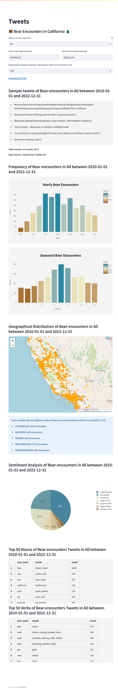

# CDFW: Utilizing NLP and ML to Analyze Human-Black Bear Conflicts in California

The California Department of Fish and Wildlife (CDFW) operates the Wildlife Health Laboratory [(WHL)](https://wildlife.ca.gov/Conservation/Laboratories/Wildlife-Health), which runs [the Human-Wildlife Conflicts Program](https://wildlife.ca.gov/Conservation/Laboratories/Wildlife-Health/HWC-Program#551962502-black-bear) aimed at mitigating human-wildlife conflict across the state. This includes issues such as property damage, public safety, animal welfare, and livestock depredation. A key area of focus for the program is the conflict between humans and [black bears](https://wildlife.ca.gov/Conservation/Mammals/Black-Bear#572681130-potential-conflict-and-depredation). As the state updates its black bear conservation and management plan, this research is of significant importance to CDFW.
To extract information from social media, primarily Twitter, and naturalist community, primarily iNaturalist, a collaborative effort between data scientists and ecology and social science specialists is being carried out. The process involves utilizing text analysis, sentiment analysis, and thematic coding techniques to analyze the data.

# Social Media NLP Project (Xin Ai)
The main focus of [the social media NLP project](https://github.com/persecond17/Black_Bear_CDFW2023/tree/main/Social_Media_NLP) is to use social media data to detect the trend and geo distribution of bear-encountering in California and understand the public's view on human-wildlife interactions. 

Our primary objective is to leverage state-of-the-art natural language processing (NLP) and machine learning (ML) algorithms to effectively classify and filter tweets that are relevant to human-bear interactions. This will be followed by performing time series forecasting and sentiment analysis on the selected tweets to extract meaningful insights. Additionally, we plan to incorporate several other factors, such as rainfall, temperature, and population density, to assess their impact on the frequency and sentiment of human-wildlife interactions. 

Utilizing the end-to-end ETL pipeline, database, and advanced models, we aim to create a user-friendly and intuitive real-time dashboard. This dashboard will provide timely and valuable insights into the public's views on human-wildlife interactions, helping the CDFW develop effective conservation and management strategies based on up-to-date and relevant information.

### **[Bear Encounter Dashboard](https://bear-encounter-in-ca.streamlit.app/)**

## Step 1: Data Extraction

The first step in this project was to set up the developer environment and obtain Twitter APIs. With the library `Tweepy`, we then wrote code to scrape over **450k** Twitter data using queries for specific time periods and geo grids. Next, we parsed the scraped data, which was in JSON format, into CSV format while extracting 13 important features and assigning reasonable coordinates for each record. Finally, we built a pipeline that automated the above processes and deployed it on a remote Airflow using VPN, creating an efficient and reliable workflow for data collection and processing.

- [7-days tweets pulling pipeline](https://github.com/persecond17/Black_Bear_CDFW2023/blob/main/Social_Media_NLP/Step_1_Data_Extraction/pull_tweets_recent.py)
- [Longterm tweets pulling pipeline](https://github.com/persecond17/Black_Bear_CDFW2023/blob/main/Social_Media_NLP/Step_1_Data_Extraction/pull_tweets_longterm.py)

## Step 2: Data Preprocessing

In this stage, we merged log files to create a comprehensive database and removed duplicate entries for uniqueness. The database was reformatted for consistency and saved for further analysis. **Spark** was used to assign a unified county label, improving computation efficiency (Broadcast join: 0.96s, Write the result: 11.86s) for a total of **5.17 billion computations**. We conducted data quality checks to ensure accuracy and reliability. Additionally, we visualized both the tweets database and iNaturalist data for reference and to gain a better understanding of the overall dataset.

- [Create database](https://github.com/persecond17/Black_Bear_CDFW2023/blob/main/Social_Media_NLP/Step_2_Data_Preprocessing/1_create_database.ipynb)
- [Calculate using spark](https://github.com/persecond17/Black_Bear_CDFW2023/blob/main/Social_Media_NLP/Step_2_Data_Preprocessing/2_calculate_using_spark.ipynb)
- [Visualization](https://github.com/persecond17/Black_Bear_CDFW2023/blob/main/Social_Media_NLP/Step_2_Data_Preprocessing/3_visualizations.ipynb)

## Step 3: Data Transformation

We refined word chunks using Part-of-Speech (POS) Tagging and performed Clustering filtering with the DBSCAN algorithm. From the most frequent words and the identified clusters, we collected keywords to help identify patterns of tweets that are not related to real bears. We then filtered tweets that mentioned these keywords, as well as cases where 'bear' was used as a verb, which resulted in a reduction of **~47%** of the data. 

However, due to the highly imbalanced data (with **< 5%** Class 1 tweets), we utilized the [GloVe](https://nlp.stanford.edu/projects/glove/) model for text representation and performed **Iterative Semi-Supervised Learning** with Spectral Clustering and AdaBoost based on the mini labeled dataset. This approach proved effective in handling extreme imbalanced data, even with only hundreds of positive labeled records, and helped us save significant time and resources.

>label = 0: not related to real bears

>label = 1: related to real bears, and even related to encountering real bears

>label = 2: related to real bears, but not related to encountering real bears

- [Filtering by tagging and clustering](https://github.com/persecond17/Black_Bear_CDFW2023/blob/main/Social_Media_NLP/Step_3_Data_Transformation/1_filtering_by_tagging_and_clustering.ipynb)
- [Handling imbalanced data](https://github.com/persecond17/Black_Bear_CDFW2023/blob/main/Social_Media_NLP/Step_3_Data_Transformation/2_handling_imbalanced_data.ipynb)
- [Appendix: Clustering from scratch](https://github.com/persecond17/Black_Bear_CDFW2023/blob/main/Social_Media_NLP/Step_3_Data_Transformation/Clustering_from_Scratch.ipynb)

## Step 4: Data Modeling

Through our extensive exploration of **6 text classification models**, including Naive Bayes, Random Forest, Support Vector Machine, Logistic Regression, AdaBoost, and Augmentation Pipeline + ML Model, we developed an ensemble model to improve the accuracy of our classification task. We began with a baseline model, tuning it through grid search, applying dimensionality reduction techniques, and implementing feature selection methods. Our ensemble model, which used the mode of votes from these models to classify text, significantly outperformed any single model used before. It improved the F1 score and accuracy from 0.642 and 0.643 (baseline) to 0.851 and 0.862 (ensemble), achieving an **~35% performance improvement**.

Using the ensemble model, we predicted 40k unlabeled data and sent the subset of records predicted as 1 or 2 to CDFW environmental scientists for manual labeling. With the returned labeled data, we rigorously fine-tuned the RoBERTa language model using strategic techniques like **stratified sampling and data augmentation**. This approach aimed to mimic the original class proportions, which was proved to be highly efficient in managing imbalanced data, and demonstrated robust performance even on unlabeled data. The successful implementation of these strategies culminated in an impressive **F1 score of 0.91**, enabling us to analyze and utilize **6017 bear-encounter-related tweets** for comprehensive data analysis and effective dashboard building.

- [ML: Text classification with ensemble model](https://github.com/persecond17/Black_Bear_CDFW2023/blob/main/Social_Media_NLP/Step_4_Data_Modeling/text_classification_with_ensemble_model.ipynb)
- [DL: Fine tune LLMs - RoBERTa](https://github.com/persecond17/Black_Bear_CDFW2023/blob/main/Social_Media_NLP/Step_4_Data_Modeling/DL_train_bi.py)
- [Sentiment analysis](https://github.com/persecond17/Black_Bear_CDFW2023/blob/main/Social_Media_NLP/Step_4_Data_Modeling/sentiment_analysis.ipynb)
- [Environmental factors analysis](https://github.com/persecond17/Black_Bear_CDFW2023/blob/main/Social_Media_NLP/Step_4_Data_Modeling/environmental_analysis.ipynb)

## Further exploration

- If you would like to learn more, please click on the [report](https://github.com/persecond17/Black_Bear_CDFW2023/blob/main/Social_Media_NLP/NLP_social_media_report.pdf).

# Collaborating reminder

When you push your code to the repository, it might cause errors on other's machines if they don't have all the libraries you used. Please use the [twi.yml](https://github.com/persecond17/CDFW2023/blob/main/twi.yml) file in the repo to create/update the virtual environment for running programs on your end.

A branch allows you to work independently of the master branch. After contributed to your branch, you can make a pull request to merge it with the master branch.

## Environment setting

First, pull twi.yml file:

`$ git pull`

Create or update an environment using twi.yml on your local machine:

`$ conda env create -f twi.yml -n [name_of_your_environment]` 
`$ conda env update -f twi.yml -n [name_of_your_environment]`

Activate or deactivate your environment on your local machine:

`$ conda activate [name_of_your_environment]` 
`$ conda deactivate`

Export the environment file to share and reproduce the current environments:

`$ conda env export > twi.yml`

Commit your contributions:

`$ git commit -a -m 'commit message'`

Push your updated environment onto github:

`$ git push origin`

## Creating a Branch

First, pull changes from upstream before creating a new branch:

`$ git pull`

Create a branch on your local machine and switch into this branch:

`$ git checkout -b [name_of_your_branch]`

Commit your contributions to this branch:

`$ git commit -a -m 'commit message'`

Push your branch onto github:

`$ git push origin [name_of_your_branch]`

Pushing your branch will create a pull request that can be reviewed before merging it with the master branch. You can follow the path **Pull requests -> New pull request -> (base: main, compared: your_branch) -> Create pull request** to create code review tasks on GitHub pages. 

If there is no conflict on files, you may click **Merge pull request -> Confirm merge -> Delete branch** to complete the merge process.